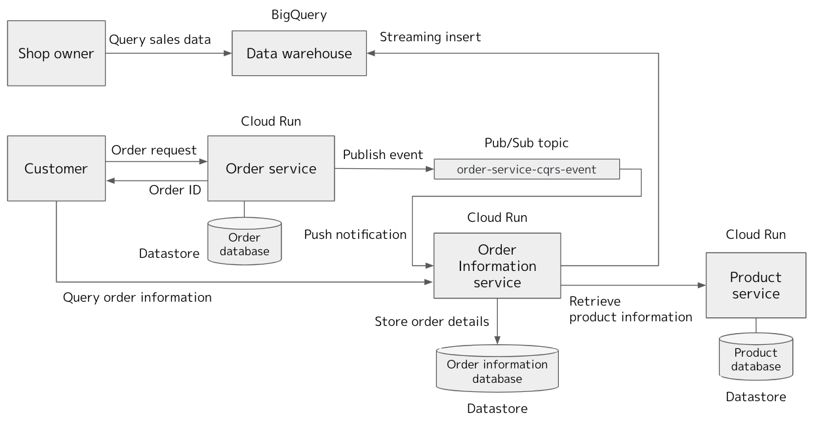

# Lab: Using GCP services to implement the CQRS pattern in microservices architecture

Disclaimer: This is not an official Google product.

## Products
- [Cloud Run][1]
- [Datastore][2]
- [Pub/Sub][3]
- [Cloud Scheduler][4]

[1]: https://cloud.google.com/run
[2]: https://cloud.google.com/datastore
[3]: https://cloud.google.com/pubsub
[4]: https://cloud.google.com/scheduler


## Language
- [Python][6]

[6]: https://www.python.org/

## Introduction

In the microservices architecture, each service maintains its own database instead of sharing a central database. It's necessary to avoid a tight coupling of microservices. However, it sometimes makes difficult to join data across multiple microservices. You may use a data aggregation service that collects and joins data from multiple services based on a query requests from clients. The Command and Query Responsibility Segregation (CQRS) pattern is another way to deal with the data aggregation problem. You deploy a query service that is responsible for maintaining a readonly database containing the pre-joined (denormalized) data. It receives events containing data updates from other services and updates its own database, if necessary, by joining them with other data from various data sources. When it receives a query request from a client, it sends back the pre-joined data from its database.

The following diagram shows an example usecase of the CQRS pattern. It emulates a part of the order process of an online shopping system.



1. A customer requests an order specifying the product ID and number of products.
2. The Order service assigns an unique order ID and publishes an event.
3. The Order information service receives the event, retrieves product information from the Product service, and stores the aggregated information.
4. The Order information service stores the same information in the data warehouse (BigQuery) with the streaming insert.
5. The customer retrieves the order information from the Order information service with specifying an order ID. The customer can also retrieve information of multiple orders with specifying the range of order dates such as in 2021, or in 2021/01.
6. A shop owner can analyze the order data with the data warehouse.

In this architecture, the Order service maintains the minimum amount of data, such as order id and product id, that is necessary to keep track of the order status. It doesn't record the product information maintained by the Product service. However, the customer may need broader information such as product names contained in the order. The Order information service maintains the database that contains all the information that a customer needs to know. In this example, it retrieves product information from the Product service and join it with the order information received from the Order service. The customer can query the information related to its orders against the Order information service.

>**Note**: In this example, the Order service does not maintain the order status. However, in a real usecase, it may participate in the transactional workflow to maintain the order status as in the example [Using GCP services to execute transactional workflows in microservices architecture](../../main/README.md).

The Order information service also sends the aggregated information to the data warehouse. The shop owner can analyze the stored data using queries in SQL. While the APIs of the Order information service accept only the predefined queries, the data warehouse can be used for ad-hoc data analysis and the backend database of other BI tools.

>**Note**: For details of the asynchronous communication using PubSub events, read [Notes on the event publishing process](../../main/README.md#notes-on-the-event-publishing-process).

## Build the example application

### Prerequisites

1. A Google Cloud Platform Account

1. [A new Google Cloud Platform Project][8] for this lab with billing enabled

1. Select "Datastore mode" from [the Datastore menu on Cloud Console][0].

[8]: https://console.cloud.google.com/project
[9]: https://console.cloud.google.com/apis/library
[0]: https://console.cloud.google.com/datastore

## Do this first

In this section you will start your [Google Cloud Shell][10] and clone the application code repository to it.

1. [Open the Cloud Console][11]

1. Click the Google Cloud Shell icon in the top-right and wait for your shell to open.

1. Set your project ID in the environment variable.

```shell
PROJECT_ID=[your project ID]
```

3. Set project ID in the session.

```shell
gcloud config set project $PROJECT_ID
```

4. Enable the Cloud Run API, Cloud Build API and Cloud Scheduler API.

```shell
gcloud services enable \
  run.googleapis.com \
  cloudbuild.googleapis.com \
  cloudscheduler.googleapis.com
```

5. Clone the lab repository in your cloud shell.

```shell
cd $HOME
git clone https://github.com/GoogleCloudPlatform/transactional-microservice-examples
```

[10]: https://cloud.google.com/cloud-shell/docs/
[11]: https://console.cloud.google.com/

## Deploy server-side components

### Build container images and deploy them on Cloud Run

```shell
cd $HOME/transactional-microservice-examples/cqrs/services/order
gcloud builds submit --tag gcr.io/$PROJECT_ID/order-service-cqrs
gcloud run deploy order-service-cqrs \
  --image gcr.io/$PROJECT_ID/order-service-cqrs \
  --platform=managed --region=us-central1 \
  --no-allow-unauthenticated

cd $HOME/transactional-microservice-examples/cqrs/services/product
gcloud builds submit --tag gcr.io/$PROJECT_ID/product-service-cqrs
gcloud run deploy product-service-cqrs \
  --image gcr.io/$PROJECT_ID/product-service-cqrs \
  --platform=managed --region=us-central1 \
  --no-allow-unauthenticated

SERVICE_NAME="product-service-cqrs"
PRODUCT_SERVICE_URL=$(gcloud run services list --platform managed \
    --format="table[no-heading](URL)" --filter="metadata.name:${SERVICE_NAME}")

cd $HOME/transactional-microservice-examples/cqrs/services/orderinfo
gcloud builds submit --tag gcr.io/$PROJECT_ID/orderinfo-service-cqrs
gcloud run deploy orderinfo-service-cqrs \
  --image gcr.io/$PROJECT_ID/orderinfo-service-cqrs \
  --platform=managed --region=us-central1 \
  --no-allow-unauthenticated \
  --set-env-vars "PRODUCT_SERVICE_URL=$PRODUCT_SERVICE_URL"

cd $HOME/transactional-microservice-examples/cqrs/services/event-publisher
gcloud builds submit --tag gcr.io/$PROJECT_ID/event-publisher
gcloud run deploy event-publisher \
  --image gcr.io/$PROJECT_ID/event-publisher \
  --platform=managed --region=us-central1 \
  --no-allow-unauthenticated \
  --set-env-vars "PROJECT_ID=$PROJECT_ID"
```

Create a BQ table for order information.

```shell
cd $HOME/transactional-microservice-examples/cqrs/services/orderinfo
bq mk --dataset $PROJECT_ID:cqrs_example
bq mk --table cqrs_example.order_information table_schema.json
```

Create an index for Datastore.

```shell
cd $HOME/transactional-microservice-examples/cqrs/services/orderinfo
gcloud datastore indexes create index.yaml --quiet

cd $HOME/transactional-microservice-examples/cqrs/services/event-publisher
gcloud datastore indexes create index.yaml --quiet
```

Open [the Datastore's index menu][13] on Cloud Console and wait a few minutes until the index becomes ready.

[13]: https://console.cloud.google.com/datastore/indexes

### Create a service account to invoke microservices on Cloud Run

You need a service account with an appropriate role to invoke REST APIs of microservices running on Cloud Run.

```shell
SERVICE_ACCOUNT_NAME="cloud-run-invoker"
SERVICE_ACCOUNT_EMAIL=${SERVICE_ACCOUNT_NAME}@${PROJECT_ID}.iam.gserviceaccount.com
gcloud iam service-accounts create $SERVICE_ACCOUNT_NAME \
  --display-name "Cloud Run Invoker"
```

### Define schedule to call the Event Publisher service

In this example, you define a schedule that calls the Event Publisher service in every minute. You let Scheduler use the service account, that you created in the previous step, to call the Event Publisher service with `run.invoker` role.

```shell
SERVICE_NAME="event-publisher"
gcloud run services add-iam-policy-binding $SERVICE_NAME \
    --member=serviceAccount:$SERVICE_ACCOUNT_EMAIL \
    --role=roles/run.invoker \
    --platform=managed --region=us-central1

SERVICE_URL=$(gcloud run services list --platform managed \
    --format="table[no-heading](URL)" --filter="metadata.name:$SERVICE_NAME")
gcloud scheduler jobs create http event-publisher-scheduler \
       --schedule='* * * * *' \
       --http-method=GET \
       --uri=${SERVICE_URL}/api/v1/event/publish \
       --oidc-service-account-email=$SERVICE_ACCOUNT_EMAIL \
       --oidc-token-audience=${SERVICE_URL}/api/v1/event/publish
```

### Create Pub/Sub topics

The topic `order-service-cqrs-event` is used to publish events from the Order service.

```shell
gcloud pubsub topics create order-service-cqrs-event 
```

### Define push-subscriptions to notify events to microservices

First, you assign `iam.serviceAccountTokenCreator` role to the project's Pub/Sub service account so that it can create an access token that is used to invoke microservices on Cloud Run.

```shell
PROJECT_NUMBER=$(gcloud projects describe $PROJECT_ID --format "value(projectNumber)")
gcloud projects add-iam-policy-binding $PROJECT_ID \
  --member=serviceAccount:service-${PROJECT_NUMBER}@gcp-sa-pubsub.iam.gserviceaccount.com \
  --role=roles/iam.serviceAccountTokenCreator
```

You create a push-subscription that delivers messages in the `order-service-cqrs-event` topic to the Order Information service. You let Pub/Sub use the service account that you created before to invoke the Customer service with the `run.invoker` role.

```shell
SERVICE_NAME="orderinfo-service-cqrs"
SERVICE_URL=$(gcloud run services list --platform managed \
  --format="table[no-heading](URL)" --filter="metadata.name:${SERVICE_NAME}")

gcloud run services add-iam-policy-binding $SERVICE_NAME \
  --member=serviceAccount:$SERVICE_ACCOUNT_EMAIL \
  --role=roles/run.invoker \
  --platform=managed --region=us-central1

gcloud pubsub subscriptions create push-order-to-orderinfo \
  --topic order-service-cqrs-event \
  --push-endpoint=${SERVICE_URL}/api/v1/orderinfo/pubsub \
  --push-auth-service-account=$SERVICE_ACCOUNT_EMAIL
```

## Test the server-side components

Before using a web client, you test the server-side components using the `curl` command.

Set environment variables to point URLs of API endpoints of microservices.

```shell
SERVICE_NAME="order-service-cqrs"
ORDER_SERVICE_URL=$(gcloud run services list --platform managed \
    --format="table[no-heading](URL)" --filter="metadata.name:${SERVICE_NAME}")

SERVICE_NAME="product-service-cqrs"
PRODUCT_SERVICE_URL=$(gcloud run services list --platform managed \
    --format="table[no-heading](URL)" --filter="metadata.name:${SERVICE_NAME}")

SERVICE_NAME="orderinfo-service-cqrs"
ORDERINFO_SERVICE_URL=$(gcloud run services list --platform managed \
    --format="table[no-heading](URL)" --filter="metadata.name:${SERVICE_NAME}")
```

Create a new product entry.

```shell
curl -X POST -H "Authorization: Bearer $(gcloud auth print-identity-token)" \
  -H "Content-Type: application/json" \
  -d '{"product_id":"product00001", "product_name":"Gaming Display", "unit_price": 500}' \
  -s $PRODUCT_SERVICE_URL/api/v1/product/create | jq .
```
[Output]
```json
{
  "product_id": "product00001",
  "product_name": "Gaming Display",
  "unit_price": 500
}
```

Create one more product entry.

```shell
curl -X POST -H "Authorization: Bearer $(gcloud auth print-identity-token)" \
  -H "Content-Type: application/json" \
  -d '{"product_id":"product00002", "product_name":"Web Camera", "unit_price": 100}' \
  -s $PRODUCT_SERVICE_URL/api/v1/product/create | jq .
```
[Output]
```json
{
  "product_id": "product00002",
  "product_name": "Web Camera",
  "unit_price": 100
}
```

You can retrieve the product information from the Product service.

```shell
curl -X POST -H "Authorization: Bearer $(gcloud auth print-identity-token)" \
  -H "Content-Type: application/json" \
  -d '{"product_id":"product00001"}' \
  -s $PRODUCT_SERVICE_URL/api/v1/product/get | jq .
```
[Output]
```json
{
  "product_id": "product00001",
  "product_name": "Gaming Display",
  "unit_price": 500
}
```

Submit a new order.

```
curl -X POST -H "Authorization: Bearer $(gcloud auth print-identity-token)" \
  -H "Content-Type: application/json" \
  -d '{"customer_id":"customer01", "product_id": "product00001", "number":1}' \
  -s $ORDER_SERVICE_URL/api/v1/order/create | jq .
```
[Output]
```json
{
  "customer_id": "customer01",
  "number": 1,
  "order_date": "2021-01-18",
  "order_id": "efc25040-34be-445b-b789-b21d24326d84",
  "product_id": "product00001"
}
```

Set the assigned `order_id` in the environment variable.

```shell
ORDER_ID="efc25040-34be-445b-b789-b21d24326d84"
```

Qeury the order information.

```shell
curl -X POST -H "Authorization: Bearer $(gcloud auth print-identity-token)" \
  -H "Content-Type: application/json" \
  -d "{\"customer_id\":\"customer01\", \"order_id\": \"$ORDER_ID\"}" \
  -s $ORDERINFO_SERVICE_URL/api/v1/orderinfo/get | jq .
```
[Output]
```json  
{
  "message": "The order does not exist."
}
```

Because the communication between the Order service and the Order information service is asynchronous, the Order information service may not have the corresponding information yet as in this result. In such a case, wait one minute, and retry. Then you receive the order information including the product information as below.

```
curl -X POST -H "Authorization: Bearer $(gcloud auth print-identity-token)" \
  -H "Content-Type: application/json" \
  -d "{\"customer_id\":\"customer01\", \"order_id\": \"$ORDER_ID\"}" \
  -s $ORDERINFO_SERVICE_URL/api/v1/orderinfo/get | jq .
```
[Output]
```json  
{
  "customer_id": "customer01",
  "number": 1,
  "order_date": "2021-01-18",
  "order_id": "efc25040-34be-445b-b789-b21d24326d84",
  "product_id": "product00001",
  "product_name": "Gaming Display",
  "total_price": 500,
  "unit_price": 500
}
```

Submit some more orders. In this example, you specify the order date explicitly. 

```shell
curl -X POST -H "Authorization: Bearer $(gcloud auth print-identity-token)" \
  -H "Content-Type: application/json" \
  -d '{"customer_id":"customer01", "product_id": "product00002", "number":1, "order_date": "2021-02-14"}' \
  -s $ORDER_SERVICE_URL/api/v1/order/create | jq .

curl -X POST -H "Authorization: Bearer $(gcloud auth print-identity-token)" \
  -H "Content-Type: application/json" \
  -d '{"customer_id":"customer01", "product_id": "product00002", "number":1, "order_date": "2020-12-31"}' \
  -s $ORDER_SERVICE_URL/api/v1/order/create | jq .
```

Retrieve the order information for a specific year, 2021.

```shell
curl -X POST -H "Authorization: Bearer $(gcloud auth print-identity-token)" \
  -H "Content-Type: application/json" \
  -d '{"customer_id":"customer01", "order_date": "2021"}' \
  -s $ORDERINFO_SERVICE_URL/api/v1/orderinfo/list | jq .
```
[Output]
```json
{
  "order_date": "2021",
  "orders": [
    {
      "customer_id": "customer01",
      "number": 1,
      "order_date": "2021-01-18",
      "order_id": "efc25040-34be-445b-b789-b21d24326d84",
      "product_id": "product00001",
      "product_name": "Gaming Display",
      "total_price": 500,
      "unit_price": 500
    },
    {
      "customer_id": "customer01",
      "number": 1,
      "order_date": "2021-02-14",
      "order_id": "2b752e27-77cd-46e5-b496-6bda77dc5fb8",
      "product_id": "product00002",
      "product_name": "Web Camera",
      "total_price": 100,
      "unit_price": 100
    }
  ]
}
```

Retrieve the order information for a specific month, Dec 2020.

```shell
curl -X POST -H "Authorization: Bearer $(gcloud auth print-identity-token)" \
  -H "Content-Type: application/json" \
  -d '{"customer_id":"customer01", "order_date": "2020-12"}' \
  -s $ORDERINFO_SERVICE_URL/api/v1/orderinfo/list | jq .
```
[Output]
```json
{
  "order_date": "2020-12",
  "orders": [
    {
      "customer_id": "customer01",
      "number": 1,
      "order_date": "2020-12-31",
      "order_id": "23cfe022-3066-4216-933f-50082939bc8b",
      "product_id": "product00002",
      "product_name": "Web Camera",
      "total_price": 100,
      "unit_price": 100
    }
  ]
}
```

Execute SQL against BigQuery to retrieve sales results for each product.

```
bq query "select product_name, sum(number) as total_number, sum(total_price) as revenue \
  from cqrs_example.order_information group by product_name"
```
[Output]
```
+----------------+--------------+---------+
|  product_name  | total_number | revenue |
+----------------+--------------+---------+
| Gaming Display |            1 |     500 |
| Web Camera     |            2 |     200 |
+----------------+--------------+---------+
```
