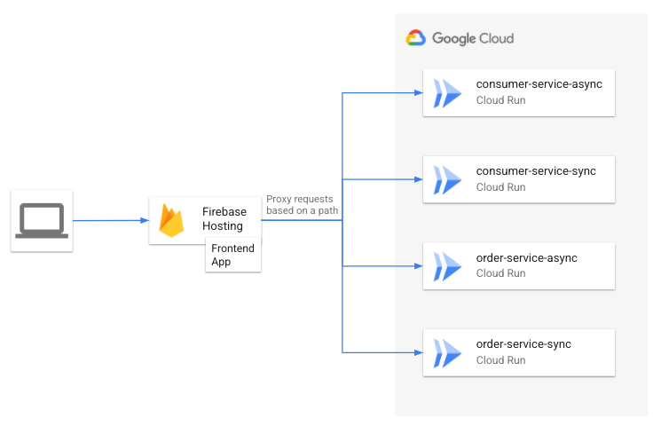

# Web frontend example

Disclaimer: This is not an official Google product.

**This is under development. You may get unexpected errors.**

## Introduction

This project works on top of the [example application](https://github.com/GoogleCloudPlatform/transactional-microservice-examples).

You deploy a web application using [Firebase Hosting](https://firebase.google.com/docs/hosting)
that interacts with backend microservices running on Cloud Run. Firebase hosting is natively
integrated with Cloud Run so that you can invoke services on Cloud Run with authentication.
In other types of deployment, you may have Cross-Origin Resource Sharing (CORS) issues. Refer
to the [link](https://cloud.google.com/run/docs/authenticating/end-users#web_apps_authentication_and_cors)
for details.



## Prerequisites

1. Complete building the example application following the
[instruction](https://github.com/GoogleCloudPlatform/transactional-microservice-examples/blob/main/README.md).

2. Open the Google Cloud Shell and set your project ID.

```shell
PROJECT_ID=[your project ID]
gcloud config set project $PROJECT_ID
```

3. We assume that you have cloned the lab repository in your cloud shell
directory `$HOME/transactional-microservice-examples`.

## Deploy the web frontend application

### Create OAuth 2.0 Client

1. Open [OAuth consent screen](https://console.developers.google.com/apis/apis/credentials/consent)
from the APIs & Services menu on Cloud Console.

1. Check [External] and click [CREATE] button.

   1. OAuth concent screen.

      1. Input App name (e.g. `Saga Frontend Demo`).
      1. Select User support email.
      1. Input Developer contact information.
      1. Click [SAVE AND CONTINUE].

   1. Scopes

      1. Just click [SAVE AND CONTINUE] to proceed.

   1. Test users

      1. Just click [SAVE AND CONTINUE] to proceed.

   1. Summary

      1. Just click [BACK TO DASHBOARD] to finish.

1. Open [Credentials](https://console.developers.google.com/apis/credentials)
from the APIs & Services menu on Cloud Console.

   1. Click [+ CREATE CREDENTIALS] and select "OAuth client ID".
   1. Select "Web application" for Application type.
   1. Click [+ ADD URI] in the "Authorized JavaScript origins" section and
   set `https://[PROJECT ID].web.app` for URIs. (Replace `[PROJECT ID]` with your project ID.)
   1. Click [CREATE].
   1. Copy OAuth client ID from the "Your Client ID" field.

1. Set the client ID that you copied in the environment variable.

```shell
CLIENT_ID=[Client ID]
```

### Refreash the firebase admin credential

Login with your google account that is the owner of your project to refresh the firebase admin credential.

```shell
firebase login --reauth --no-localhost
```

You will get a login link, **but the URL string displayed on the Cloud Shell contains line breaks
at the right end of the terminal.** Copy the URL string to your text editor and delete line breaks
before accessing the URL from your browser.

### Initialize the Firebase project

```shell
cd $HOME/gcp-saga-pattern-example/frontend
mkdir firebase_hosting
cd firebase_hosting
firebase init hosting
```

1. Select `Add Firebase to an existing Google Cloud Platform project`
1. Input the project ID that you used to deploy the backend services.
1. Press Enter Key for the name of public directory. (Use default name: public)
1. Press Enter Key for the configuration about single-page app. (Use default value: No)
1. Press Enter Key for setting up automatic builds. (Use default value: No)
1. Confirm you have successfully completed Firebase initialization.

### Update the frontend app to use the OAuth 2.0 Client ID

```shell
cp -r ../build/web/* public/
sed -i "s/__CLIENT_ID__/$CLIENT_ID/" public/index.html
```

### Deploy the frontend app with Firebase Hosting

```shell
cp ../firebase/firebase.json ./
firebase deploy
```

## Use the web frontend application.

Open the `Hosting URL` on the web browser.
