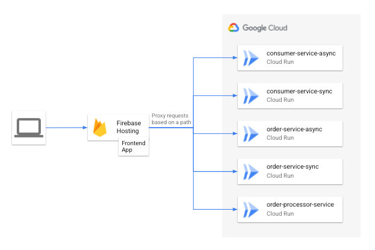

# Web frontend example

Disclaimer: This is not an official Google product.

## Introduction

This project works on top of the [example application](https://github.com/GoogleCloudPlatform/transactional-microservice-examples).

You deploy a web application using [Firebase Hosting](https://firebase.google.com/docs/hosting)
that interacts with backend microservices running on Cloud Run. Firebase hosting is natively
integrated with Cloud Run so that you can serve the web application and backend microservices services in the same domain.
In other types of deployment, you may have Cross-Origin Resource Sharing (CORS) issues. Refer
to the [link](https://cloud.google.com/run/docs/authenticating/end-users#web_apps_authentication_and_cors)
for details.



## Prerequisites

1. Complete building the example application following the
   [instruction](https://github.com/GoogleCloudPlatform/transactional-microservice-examples/blob/main/README.md).

2. Open the Google Cloud Shell and set your project ID.

   ```shell
   PROJECT_ID=[your project ID]
   gcloud config set project $PROJECT_ID
   ```

3. We assume that you have cloned the lab repository in your cloud shell
   directory `$HOME/transactional-microservice-examples`.

## Set up Firebase

### Update Node.js in Cloud Shell to the latest LTS version to use firebase CLI.

```shell
nvm install lts/gallium
```

### Add Firebase resources to the existing Google Cloud Platform project.

```shell
firebase projects:addfirebase $PROJECT_ID
```

### Add a default project alias for firebase CLI

```shell
jq -n --arg project_id $PROJECT_ID '{"projects": {"default":$project_id}}' > $HOME/transactional-microservice-examples/frontend/.firebaserc
```

## Deploy the web frontend application

### Build the web frontend application

```bash
cd $HOME/transactional-microservice-examples/frontend
yarn install && yarn build
```

### Deploy the frontend app with Firebase Hosting

```shell
firebase deploy
```

## Use the web frontend application

The web frontend application is a simple online fashion store using APIs. The application consists of five pages.

- First page

  A page to initialize the application with an identity token.

- Products page

  A page to check a product list. You will add products to the cart on this page.

- Checkout page

  A page to submit an order in the cart.

- Profile page

  A page to check the current budget.

- Order history page

  A page to check the order history.

### Input an identity token and proceed to the product page.

1. Open the `Hosting URL` url on your browser. You see the first page to input the identity token information.
2. Copy a following command or click the copy button in step 1 and paste it to Cloud Shell and execute.

   ```shell
	 gcloud auth print-identity-token
   ```

3. Copy the output from Cloud Shell and paste it to the textarea in step 2.
4. Click [Proceed] to proceed to the product page.

A new customer entry is created and logged in as the customer if the identity token is valid.


### Add products to the cart

Click "Awesome Clothes" on the navigation bar and go to the products page.
Click "Add to cart" button of a product and confirm a number on the cart icon increases.


### Check items in the cart

Click the cart icon on the navigation bar to go to the checkout page. You see items in the cart now.


### Submit an order using the asynchronous service

Make sure you are in the checkout page. Click "Submit order (Async)" button to submit an order in the cart using the asynchronous service.

### Submit an order using the synchronous service

Make sure you are in the checkout page. Click "Submit order (Sync)" button to submit an order in the cart using the synchronous service.

### Check the order history

Click "Orders" on the navigation bar to go to the orders page. You see the order history and details of orders. 


### Update the status of an uncompleted order

Make sure you are in the orders page. You see a reload icon if an order is 'pending' state.
Click the reload icon and update the status. 

### Check the budget of the customer

Click the customer name (customer-xxx) on the navigation bar to go to the profile page. You see the current budget, how much you used and remains. You cannot order over the budget and the order will be rejected.


### Reset the state in the web application

Reload the page on your browser. States like cart items, the order history and customer information will be reset and redirected to the first page.
